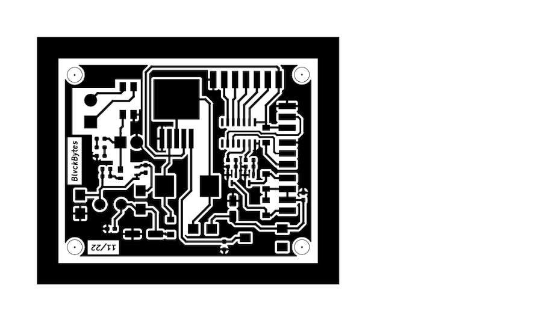

# layout_postproc

A simple PCB layout postprocessor which accomplishes simple tasks which my preferred CAD software doesn't seem to support:

- Choosing the layout's spot on the A4 page (center center seems very wasteful)
- Adding a filled border rectangle (to save on etched copper if the blank is intentionally larger)
- Rotating the SVG so that it has it's minimal height

It just takes an SVG as it's input, which all CAD programs are able to export. In essence, the SVG is being trimmed of it's whitespace by finding it's bounds and subtracting constant X/Y values from all members, an optional border rectangle is added, it's rotated 90deg (if needed) and then rendered on an A4 PDF page, based on your location choice.

## Arguments

```
usage: layout_postproc.py [-h] [-rw RECT_WIDTH] [-rd RECT_DISTANCE] [-rc RECT_COLOR] [-pp PAGE_PADDING] [-pos {TL,TC,TR,CL,CC,CR,BL,BC,BR}] input

positional arguments:
  input                 Input SVG file

options:
  -h, --help            show this help message and exit
  -rw RECT_WIDTH, --rect-width RECT_WIDTH
                        Width of the enclosing rectangle in mm
  -rd RECT_DISTANCE, --rect-distance RECT_DISTANCE
                        Distance between the content and it's enclosing rectangle
  -rc RECT_COLOR, --rect-color RECT_COLOR
                        HEX color (including #) of the enclosing rectangle
  -pp PAGE_PADDING, --page-padding PAGE_PADDING
                        Padding of the page in mm
  -pos {TL,TC,TR,CL,CC,CR,BL,BC,BR}, --position {TL,TC,TR,CL,CC,CR,BL,BC,BR}
                        Position of the content on the page
```

If you don't want an enclosing rectangle at all, just set it's width to zero (0).

## Example

This example has been rendered at position TL, with a page-padding of 10mm, a rectangle distance of 1.5mm, a rectangle width of 5mm and a rectangle color of black.

